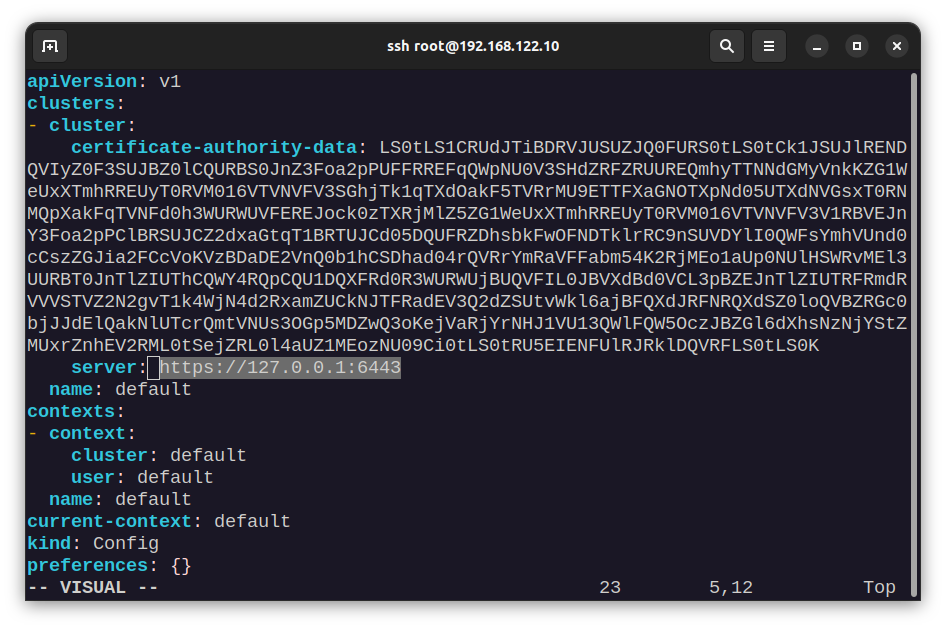

## WebPass - DevOps

Web Pass is a React based project that generator complex password to increase the password security. I chose this Application for my DevOps Project

[WebPass - GitHub](https://github.com/sajadkamali-ir/webpass "WebPass - GitHub")

### Getting started
To deploy the WebPass Project, you need the folloiwing things:
- A Computer with atleast Core I5 CPU and 16 Gigs of RAM
- A hyprrovisor like KVM
-  Debian 11 [ISO Image](http://debian.cs.nycu.edu.tw/debian-cd/11.7.0/amd64/iso-cd/debian-11.7.0-amd64-netinst.iso "ISO Image")
- Ansible
- Terraform
- Finally A working Internet!

### Virtual Machines
Here is my Virtual Machine Configuration
- **Master1:** kubernetes Master Node (192.168.122.10)
- **Worker1:** Kubernetes worker node 1 (192.168.122.20)
- **Worker2:** Kubernetes worker node 2 (192.168.122.30)
- **Worker3:** Kubernetes worker node 3 (192.168.122.40)
- **Jenkins** (192.168.122.50)

### Things to do on VMs
On all VMs perform the following things
- apt update & upgrade
- setup root password
- enable ssh root login
- add ssh-key of you computer to all servers in root user for auto ssh login

### Install The Kubernetes Cluster
To install the kubernetes cluster on VMs, you should run the following commands:
```
cd kubernetes
ansible-playbook -l all -i inventory -u root server.yaml
cd ..
```
Ansible a successful installation, ansible will automatcially create kubeconfig file (called K3s.yaml) in the project root directory. You shoiuld modify the k3s.yaml file and change the apiserver url from 127.0.0.1 to you master node IP address (Which is 192.168.122.10 in my case)

```
vim k3s.yaml
```
[](static/1.png)

### Install Jenkins
To install the Jenkins server, simply run the following commands:
```
cd jenkin
ansible-playbook -l all -i inventory -u root server.yaml
cd ..
```

### Setup CI/CD Pipeline:
The githube project of WebPass is [here](https://github.com/sajadkamali-ir/webpass "WebPass - GitHub") and I wrote a Jenkinsfile for it. So here is how to setup the Jenkins CI/CD pipeline:
[](static/2.png)
[](static/3.png)
[](static/4.png)
[](static/5.png)

### Deploy to Kubernetes
For WebPass, we a simple terraform code and you can deploy it using yhe below commands:

```
cd terraform
terraform init
terraform plan
terraform apply
cd ..
```
### And here is the final result:
[](static/6.png)
